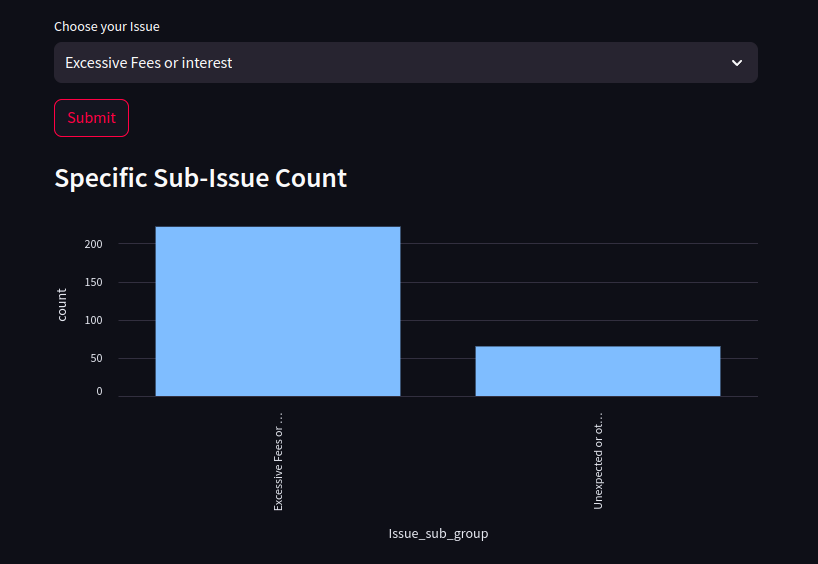
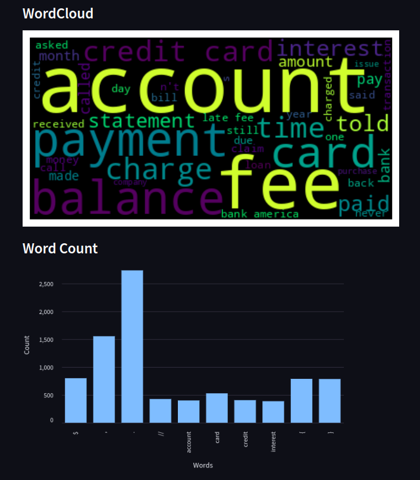
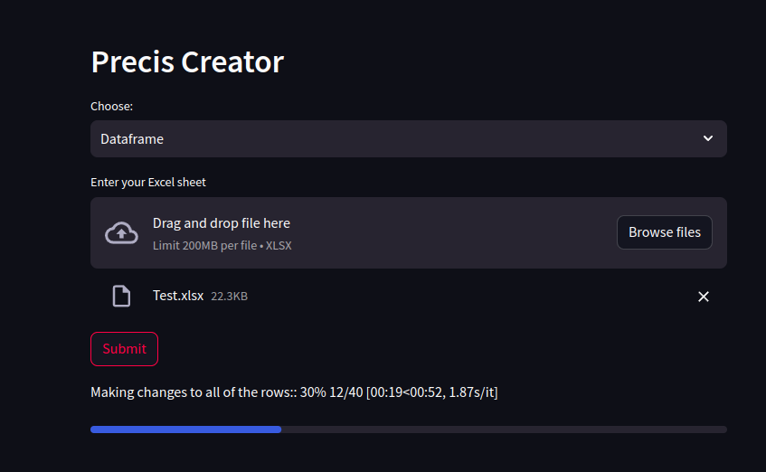
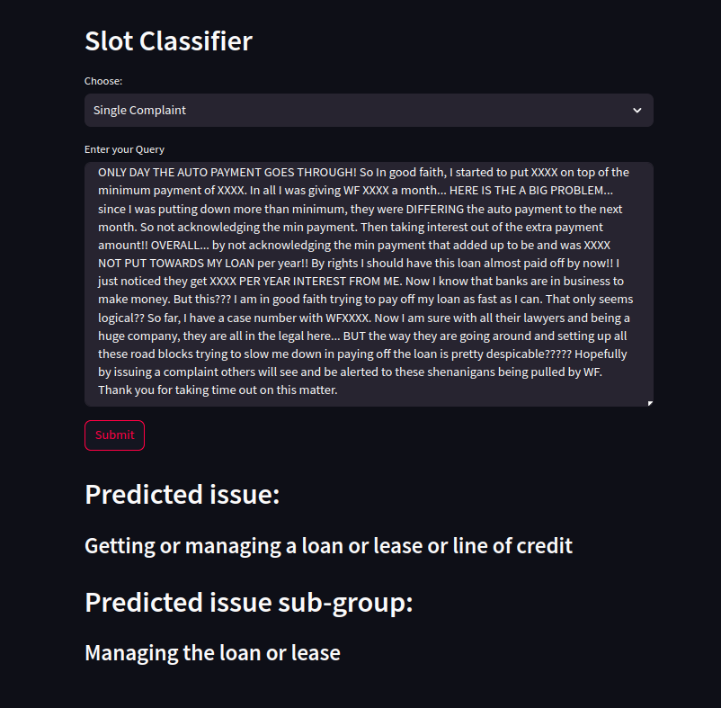

# Analyzing Consumer Complaint Data

Welcome to the repository for analyzing Amazon consumer complaint data. Here you'll find code for Exploratory Data Analysis (EDA) along with three distinct functionalities implemented using Streamlit for improved user interface.

## Functionalities

1. **Wordcloud**
   - This feature analyzes textual data from product reviews.
   - It identifies relevant sub-issues associated with a particular complaint.
   - Furthermore, it generates wordclouds showcasing the most frequently used words in the textual review section.

2. **Precis Creator**
   - Simplifying the text of complaints is the core objective of this functionality.
   - It provides concise summaries of complaint narratives, making it easier to understand the issue at hand.

3. **Slot Classifier**
   - Designed to classify complaints into their respective issues and sub-issues accurately.

## Requirements
```bash
pip install -r requirements.txt
```

## Data
All functionalities operate on a dataset named main_sheet.csv located in the data folder. This dataset comprises 40,000 consumer complaints. Pandas is utilized extensively for data manipulation and analysis.
Please download the Precis model using the following [link](https://drive.google.com/file/d/1U6U6TdR1RbRLWbjt46zJOlPZ9EOd9BNh/view?usp=sharing) and paste it in the **data/Models/Precis** folder.

## Usage

1. **WordCloud**
   - To execute the WordCloud functionality, run the command: `streamlit run dad.py`.
   - Upon execution, a bar graph displaying the top 5 issues will be presented. Users can select the issue they wish to gain insights about.

2. **Precis**
   - To utilize the Precis feature, execute: `streamlit precis.py`.
   - Users will be provided with two options: `Data Frame` or `Single Complaint`.
   - Upon submission, a text summarization model employing Transformers and Huggingface will generate a summary of the text. Additionally, users can choose to upload a dataframe (ensuring the same format as the provided xlsx file). A sample excel sheet is available in the data folder for faster inference.

3. **Slot Classifier**
   - To activate the Slot Classifier, run: `streamlit hierarchial.py`.
   - Users will be presented with two options: `Data Frame` or `Single Complaint`.
   - This classifier employs a Bag of Words Classifier TF-IDF model for classification. After entering the text, it categorizes it into an issue & sub-issue. Users also have the option to upload a dataframe. Upon submission, the predicted issue and sub-issue, along with the actual issue and non-issue, will be displayed. The accuracy of this model is approximately **98%**.


## Results
### Wordcloud



### Precis



### Slot Classifier

